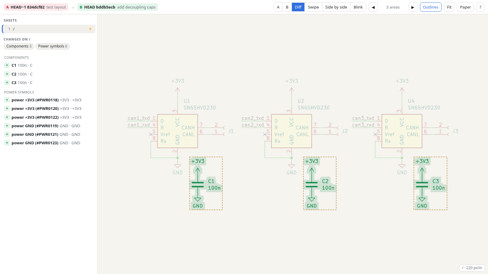
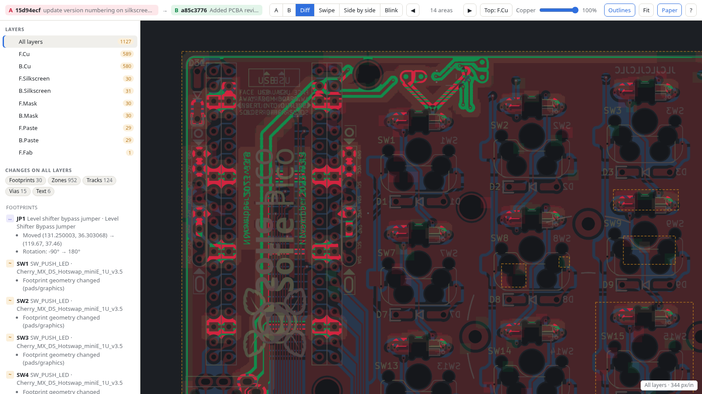

# dreiecKi

Visual diff of KiCad schematics, or PCBs with `-pcb`, between two git revisions. It produces one
self-contained, interactive HTML file.

**[Live demo](https://uberrice.github.io/dreiecki/):** a schematic and a PCB report from a small test project.

```sh
dreiecki HEAD~1                 # last commit vs. working tree
dreiecki main my-branch         # two branches / tags / commits
dreiecki v7..v8 -o review.html --open
dreiecki -s boards/main/main.kicad_sch HEAD~3   # pick the root schematic explicitly
dreiecki -pcb HEAD~1            # the board instead of the schematic
```

Requirements: `git`, and `kicad-cli` from KiCad 8 or newer for rendering. The viewer works offline in any
current browser.

## What you get

* **Sheets list:** every page of the hierarchy, including sheets that are used more than once,
  each flagged as same / changed / new / deleted.
* **Views:** A, B, Diff (removed ink red, added ink green, rest faded), Swipe,
  synced Side-by-side and Blink.
* **Area navigation:** areas that differ at the pixel level are outlined. Step through them with `n` / `p`.
* **Change list:** components (value, footprint, any field, symbol, unit, DNP/BOM flags, moves),
  labels, wires, junctions, text, sheet symbols and graphics. Click one to zoom to it.



With `-pcb` the same viewer shows the board instead:

* **Layers list:** an "All layers" overview (copper, silkscreen and board outline), then every copper
  layer and each technical layer that has something on it, each drawn together with Edge.Cuts.
* **Layer stacking:** on "All layers", the **Copper** slider makes the copper layers translucent, and
  `v` (or the **Top** button) cycles which copper layer is drawn above the others. Changed areas are
  always found with opaque copper and the front layer on top, so they don't depend on these settings.
* **Change list:** footprints (reference, value, any field, footprint, side, attributes, pad nets,
  pad/graphics geometry, moves and rotation), tracks, vias, zones, board text and graphics, added or
  removed nets, and title block / board setup. The overview lists every change, and each layer lists
  the changes that touch it. Nets are compared by name, so renumbering them is not a change.



Board colours come from your KiCad PCB colour theme, so PCB reports start on dark paper. The
**Paper** button switches to light paper.

Press `?` in the viewer for keyboard shortcuts. A URL hash such as `#mode=swipe&sheet=/power&area=2`
opens a specific view.

## How it works

For each revision, the needed files are read with `git show` (the root sheet, every sub-sheet it
references, the `.kicad_pro` and the drawing sheet). They are written to a temp directory and
rendered with `kicad-cli sch export svg`. The schematic S-expressions are compared object by object.
Objects are matched by UUID, falling back to reference or content. The pixel comparison runs in the
browser. For boards, the `.kicad_pcb` and project files are read the same way and each page is plotted
with `kicad-cli pcb export svg`.

## Flags

```
-s FILE              root .kicad_sch, or .kicad_pcb (default: auto-detect)
-pcb                 compare the board instead of the schematic (implied by -s *.kicad_pcb)
-o FILE              output HTML (default: dreiecki-<a>-<b>.html, dreiecki-pcb-<a>-<b>.html with -pcb)
-open                open in browser
-no-drawing-sheet    leave out the title block / frame
-theme NAME          KiCad colour theme for rendering
-kicad-cli PATH      kicad-cli location
-keep-temp           keep the rendered SVGs
```

Building from source and cutting releases: see [docs/develop.md](docs/develop.md).
